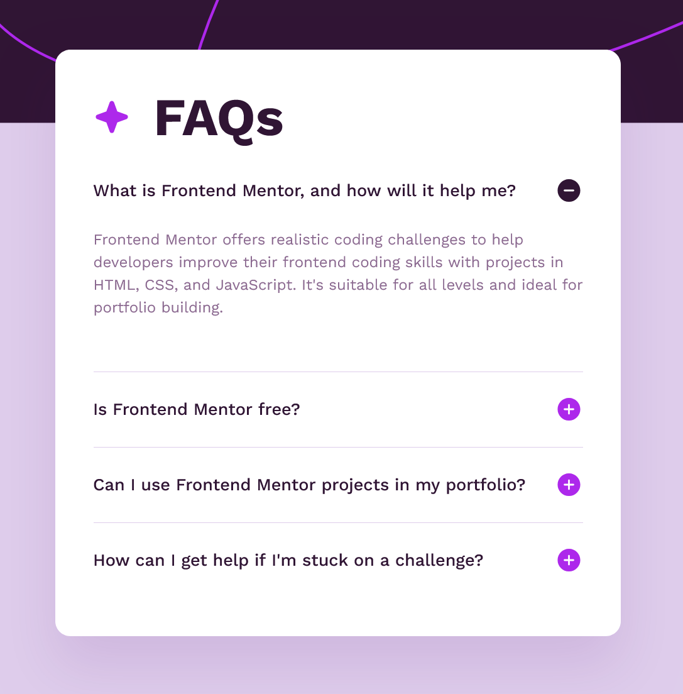

# Frontend Mentor - FAQ accordion solution

This is a solution to the [FAQ accordion challenge on Frontend Mentor](https://www.frontendmentor.io/challenges/faq-accordion-wyfFdeBwBz). Frontend Mentor challenges help you improve your coding skills by building realistic projects.

## Table of contents

- [Overview](#overview)
  - [The challenge](#the-challenge)
  - [Screenshot](#screenshot)
  - [Links](#links)
- [My process](#my-process)
  - [Built with](#built-with)
  - [What I learned](#what-i-learned)
  - [Continued development](#continued-development)
  - [Useful resources](#useful-resources)
- [Author](#author)


## Overview

### The challenge

Users should be able to:

- Hide/Show the answer to a question when the question is clicked
- Navigate the questions and hide/show answers using keyboard navigation alone
- View the optimal layout for the interface depending on their device's screen size
- See hover and focus states for all interactive elements on the page

### Screenshot



### Links

- [Frontend Mentor solution page](https://your-solution-url.com)
- [FAQ Accordion live site](https://faq-accordion-peach-gamma.vercel.app/)

## My process

### Built with

- Semantic HTML5 markup
- CSS custom properties
- Flexbox
- CSS Grid
- Mobile-first workflow
- [Astro](https://astro.build/) - JS web framework

### What I learned

I borrowed much of my approach for handling the accordion panel opening and closing from Kevin Powell (referenced below). I tried a couple of other things first before settling on `flex-basis` and `flex-grow`. It seemed to generate the most consistently smooth animation.

```css
.accordion-panel {
  flex-basis: calc((var(--spacing-100) * 2) + var(--spacing-500));
  overflow: hidden;
}

.accordion-panel:not(:last-child) {
  border-bottom: 1px solid var(--clr-purple-100);
}

@media (prefers-reduced-motion: no-preference) {
  .accordion-panel {
    transition: flex-basis 500ms, flex-grow 500ms;
  }
}

.accordion-panel:has([aria-expanded='true']) {
  flex-basis: clamp(6rem, 30vh, 13rem);
  flex-grow: 1;
}
```

I decided to stick with JavaScript for handling the accordion interaction, but kept the code as straightforward as possible. Though the design comp doesn't explicitly state that only one FAQ panel should be open at a time, looking over various resources pointed me toward the approach (for both improved UX and accessibility). 

```js
const toggleButtons = document.querySelectorAll(".accordion-trigger");

toggleButtons.forEach((button) => {
  button.addEventListener("click", (e) => {
    const targetButton = (e.target as HTMLElement).closest(".accordion-trigger") as HTMLElement;
    hideAnswers();
    showAnswer(targetButton);
  });
});

function showAnswer(btn: HTMLElement) {
  const answerId = btn?.getAttribute("aria-controls") as string;
  const targetAnswer = document.getElementById(answerId);
  btn?.setAttribute("aria-expanded", "true");
  targetAnswer?.setAttribute("aria-hidden", "false");
}

function hideAnswers() {
  document
    .querySelectorAll(".accordion-content")
    .forEach((answer) => {
      answer.setAttribute("aria-hidden", "true");
    });
  document
    .querySelectorAll(".accordion-trigger")
    .forEach((trigger) => trigger.setAttribute("aria-expanded", "false"));
}
```

### Continued development

It was surprising how little CSS was actually needed to match the design comp and get the accordion behavior to work properly. In a future iteration of this project, I would likely use Tailwind rather than the custom CSS I have here.

I also recoginze I could have improved this component's rendering logic by adding React to the build. In the end, I decided to approach the challenge with a combination of CSS, JavaScript, and semantic markup to keep the focus on the accessibility elements of the project.

### Useful resources

- [Kevin Powell](https://www.youtube.com/watch?v=WJERnXiFFug) - This excellent video tutorial from Kevin Powell is a couple of years old now, but the content and best practices presented are still relevant. The project Kevin works on in this video is visually different from mine, but much of my accordion's structure was modeled after his markup (as well as the resource below), and my styles and transition animations are a slimmed-down, inspired version of what he's doing in this video. It's a really helpful watch.
- [A11Y collective](https://www.a11y-collective.com/blog/accessible-accordion/#h-using-semantic-html-in-accordion-components) - The A11Y Collective is another great resource for all things accessibility, and this article in particular is extremely helpful in approaching an accessible accordion component. 

## Author

- Website - [Matt Pahuta](https://www.mattpahuta.com)
- Frontend Mentor - [@mattpahuta](https://www.frontendmentor.io/profile/MattPahuta)
- Bluesky - [@mattpahuta](https://bsky.app/profile/mattpahuta.bsky.social)
- LinkedIn - [Matt Pahuta](www.linkedin.com/in/mattpahuta)